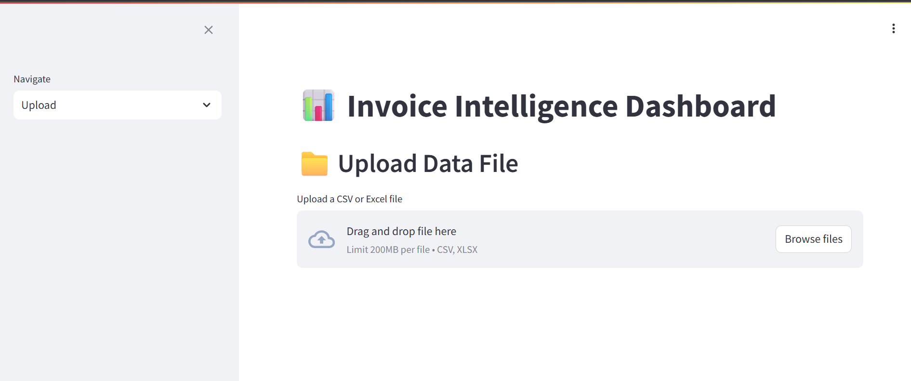
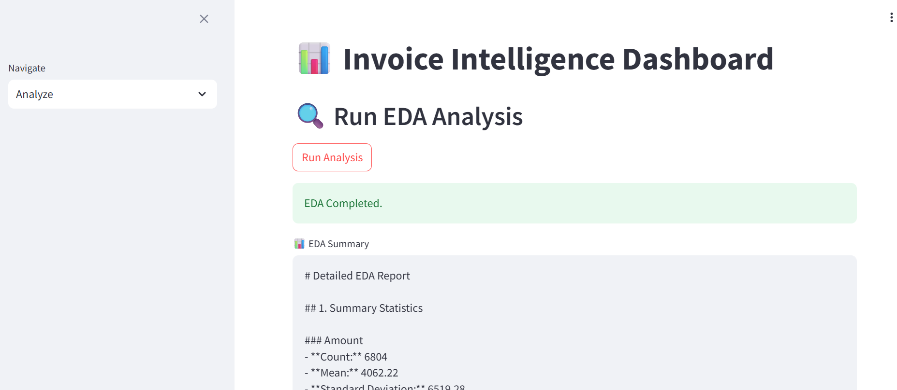
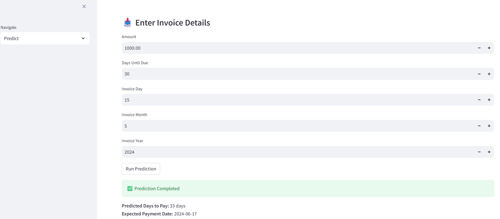
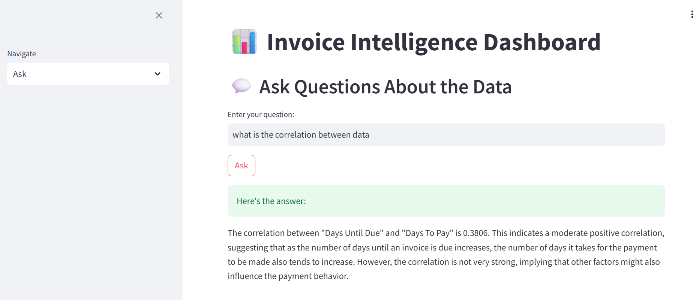

# 💬 Financial Analysis Chatbot

An AI-powered financial chatbot that enables interactive analysis of invoice data. Users can upload CSV/Excel files, perform automated Exploratory Data Analysis (EDA), predict payment delays using advanced machine learning models, and ask natural language questions about the dataset through an integrated OpenAI-based chatbot.

🟢 **Live Demo:** [Click here to try it](http://34.73.237.216:8002/)

---

## 📚 Table of Contents

- [Features](#-features)
- [Frontend Preview](#-frontend-preview)
- [Tech Stack](#-tech-stack)
- [Machine Learning Details](#-machine-learning-details)
- [Installation](#-installation)
- [API Endpoints](#-api-endpoints)
- [Deployment](#-deployment)
- [License](#-license)

---

## 🚀 Features

- ✅ **File Upload:** Supports `.csv` and `.xlsx` invoice datasets via an intuitive Streamlit UI.
- 📊 **Automated EDA:** Performs data profiling including:
  - Correlation matrix
  - Variance analysis
  - Value distribution
  - Outlier detection
  - Visual summaries (bar plots, histograms, heatmaps)
- 🔮 **ML-Based Prediction:**
  - Predicts the number of days it will take a client to pay (`days_to_pay`)
  - Uses an advanced **Stack Regressor** that combines multiple base learners for better performance
- 💬 **AI Chatbot Interface:**
  - Integrated with **OpenAI API**
  - Users can ask questions like:
    - *"What is the correlation between invoice amount and days to pay?"*
    - *"Show insights for April invoices."*
- 🌐 **Full-Stack Integration:**
  - Backend: FastAPI
  - Frontend: Streamlit
  - Deployment: Google Cloud Platform (GCP)

---

## 🖼️ Frontend Preview

| Upload Page | EDA Output | Prediction Page | Chatbot |
|-------------|------------|-----------------|----------|
|  |  |  |  |


---

## 🧠 Machine Learning Details

- **Target Variable**: `days_to_pay`
- **Model Type**: Stacked Regressor
- **Base Models**:
  - Random Forest Regressor
  - XGBoost Regressor
- **Meta Model**:
  - Linear Regression
- **Performance Goal**: Improve generalization and reduce prediction error by combining strengths of multiple models.

---

## 🛠️ Tech Stack

- **Backend**: FastAPI (Python)
- **Frontend**: Streamlit
- **ML Libraries**: scikit-learn, XGBoost, pandas, matplotlib, seaborn
- **LLM Integration**: OpenAI API (GPT)
- **Deployment**: Google Cloud Platform (GCP)

---

## 📦 Installation

```bash
# Clone the repository
git clone https://github.com/yourusername/financial-analysis-chatbot.git
cd financial-analysis-chatbot

# Create virtual environment
python -m venv venv
source venv/bin/activate  # For Windows: venv\Scripts\activate

# Install dependencies
pip install -r requirements.txt

# Start FastAPI backend
uvicorn app.main:app --reload

# In a new terminal, start Streamlit frontend
streamlit run frontend/app.py
